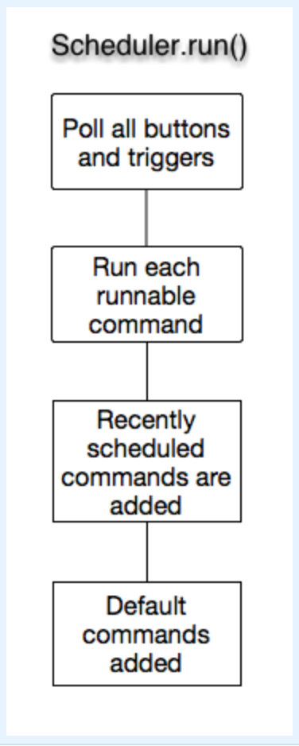

# Command-based Programming: Overview

Spartronics team uses WPI's command-based design pattern to organize robot code. For an introduction to command-based programming, also see [What is Command Based Programming?](https://wpilib.screenstepslive.com/s/4485/m/13810/l/241892-what-is-command-based-programming)

When we model our robot, we are identifying the things our robot does, and data and state it needs to manage. These roughly translate to Commands and Subsystems.

## Subsystems
Subsystems model the physical components on the robot: drivetrain, elevator, launcher, ... In short, subsystems define the capabilities for each major part of the robot.

Each of these subsystems have methods that allows reading and manipulating the state of that subsystem: drive, isStopped, getDistance, ...

Each subsystem class is a subclass of the WPILib Subsystem class.

```java
import edu.wpi.first.wpilibj.command.Subsystem;
import edu.wpi.first.wpilibj.command.PIDSubsystem;
import edu.wpi.first.wpilibj.command.Scheduler;

public class IntakeLauncher extends Subsystem {
  ...
}
```

For subsystems with PID, you can use ```edu.wpi.first.wpilibj.command.Subsystem``` for access to convenience methods.

### Subsystem design steps
1. Describe your subsystem's behavior and how it transitions. Behaviors are activities that we can observe externally: _move forward_, _turn_, _stop_... Think about what behaviors can run concurrently and what requires a sole attention: _can you chew gum and brush teeth at the same time?_
2. Brainstorm things your subsystem needs to do: _move forward some distance_, _turn some degrees_, _adjust speed_...
3. Identify internal and/or external data it needs to do its job accurately and correctly: _sensor info on distance moved_, _current speed_, _current heading_...


## Commands
Commands enable us to operate our robot as a system. Commands are small chunks of tasks from different subsystems that we can chain together to perform more complex operations. As such, Commands can be tested individually. Each subsystem can also have a default command, which will run when no other running commands require that subsystem.
- Move forward 15 ft while lowering the arm and shoot
- Grab the garbage can and move to 4th elevator position while driving
- Lower arms, put intake to neutral and drive forward

```java
import edu.wpi.first.wpilibj.command.Command;
import edu.wpi.first.wpilibj.command.CommandGroup;
import edu.wpi.first.wpilibj.command.Scheduler;


public class IntakeBallCommandGroup extends CommandGroup {
  ...
}

public class StopWheelsCommand extends Command {
  ...
}
```

Commands are executed sequentially, and need to be scheduled. They can be tied to autonomous modes, operator interface buttons, or SmartDashboard virtual buttons for scheduling.

Commands can also be grouped together allowing the ability to run commands concurrently. Once the group is created, similar to Commands, it can be tied to a single entry to executing all the commands in this group. A command group finishes when all the commands started in that group finish.

> Important: Commands require subsystem(s) to be present.  Command groups automatically require all the subsystems for each of the commands in the group. This puts additional constraints on your subsystem design: _should you combine two similarly related subsystems as one?_ Make sure you think through the operational needs of the system as that dependency may complicate future commands.


## Scheduler
The scheduler is responsible for scheduling Commands. Although many commands maybe running virtually at the same time, robot code is single threaded, i.e. there is only a single main robot thread. As a note, PID loops on CANTalons are separate threads of execution.

Every 20ms (when driver station update takes place), the scheduler walks through its table of Commands to determine what commands need to be scheduled or marked as completed. For this, the scheduler calls each command's _execute()_ followed by _isFinished()_ methods. If _isFinished()_ is true, command is removed from the scheduling queue.



If a command is interruptable, the scheduler will interrupt the running command to schedule the new one: pushing elevator down button will interrupt the elevator move up command.
