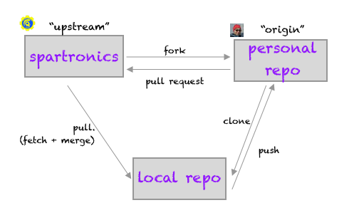

# Introducing Git and GitHub
<!-- TOC -->

- [Introducing Git and GitHub](#introducing-git-and-github)
- [What is Git and GitHub?](#what-is-git-and-github)
- [Common Terms](#common-terms)
    - [What is workflow? And, what does it have to do w/ git?](#what-is-workflow-and-what-does-it-have-to-do-w-git)
    - [Why command-line for git vs. GUI app?](#why-command-line-for-git-vs-gui-app)
    - [What is a repo and remotes?](#what-is-a-repo-and-remotes)
    - [What is cloning or forking, and upstream?](#what-is-cloning-or-forking-and-upstream)
    - [What is branching? Checkout what?!](#what-is-branching-checkout-what)
    - [What does it mean to pull and merge? And pull request?](#what-does-it-mean-to-pull-and-merge-and-pull-request)
    - [What is commit vs stash vs push?](#what-is-commit-vs-stash-vs-push)

<!-- /TOC -->

# What is Git and GitHub?
Git is a distributed version control system -- "distributed" meaning that
every user of a repository can act on it independently from a central server;
and "version control" meaning that changes to the project are tracked so that
they can be reviewed and be applied to the project one at a time. Git
allows any developer to have full read/write access to the repository. Project
workflow and governance rules dictates who can make changes and how contributions
will be integrated into the main project repository.

Git is a robust and a simple system that handles large or small projects
efficiently. It is a great way for teams to work together, its flexible model
allows workflows to match the way a team works. And, for an individual
developer it is a fantastic resource to track and manage ones work.

GitHub is a public, centralized server on which repositories can be shared.
Git has a rich ecosystem of hosting solutions (GitHub, GitLab, ...),
visual tools for ease of use (SourceTree, Git Extensions, ...),
and is integrated into many tools (such as VS Code and Eclipse). For our
purposes, we use the git command-line with Terminal or git bash application.

# Common Terms
As with any language, git has its own terminology. Understanding these terms
and meaning makes learning git easier.

## What is a workflow? And, what does it have to do with git?
Workflow refers to a sequence of steps that are required to proceed from
initiation to completion. At its core, the development workflow involves
the following three steps:

* _dev_: development work, writing code using your text editor
* _test_: build and verify that code works to its specification, fix as needed
* _prod_: deploy to production, in the case of FIRST this would be our robot

Git enables teams to establish workflow they need to get to production ready code.
Steps include, but are not limited to:
* deploying pre-production code to "staging" for testing
  * git branching simplifies managing staging vs. production code
* enforcing code reviews before merging code
  * pull requests ensure code is properly reviewed before merging
* identifying specific versions in order to track important releases, such as at competitions
  * tags can be applied to specific commits to mark a point in the timeline of the project

Git, though confusing at first, gives full empowerment to individuals --
it is really difficult to break anything in git that cannot be fixed unless you
deleted code before checking things in, or deleted the local repository before
pushing to the remote server. So, don't be afraid to experiment,
[_commit often, perfect later, publish once_](https://sethrobertson.github.io/GitBestPractices/).

## Why command-line for git vs. GUI app?
For our purposes, we use git command-line via the Terminal or git bash app. If you
learn the fundamentals of the command-line interface, you will have easier time
mapping them back to a GUI app, however that is not the case in reverse. In addition,
the command-line is clean and straight-forward, and as mentors we have first hand
experience where GUI apps can lead someone astray by automating too much of the
workflow.

## What is a repo and remotes?
The repo (repository) is a copy of the project and all of it's history. Every change
ever made to the project is stored as discrete commits to the repo. Each developer
has a local copy of the repository, and can examine the changes and add their own.
When changes are shared, developers publish a copy of their repository back
to GitHub, the central code hosting system. This is referred to as the remote repo,
which is accessed by its URL.

## What is cloning or forking, and upstream?
To create a copy of a repo on GitHub, a developer will "fork" the repo using the
web interface. This copy is stored in the developer's GitHub account, and is
identical to the original repository. The developer has full ownership of this
copy, and make any they want without having to coordinate with others. Note that
"fork" is a GitHub term, and is not a command within the git tool itself.

To download the repo to the developer's computer, so that it can be easily edited
and built, they will "clone" the repo. The URL of the repo is copied from the
web interface, and the git command "clone" will then fetch the repository history
and make the files available to the developer. After cloning, the git repo on
the developer machine remembers the URL of the repo on GitHub, and refers to
it as the "origin" of the repo.

Project governance and policies determines which repo is the most important
version. The relationships between the projects are not fixed in stone -- it is
like a web. Generally, the "official" version is referred to as the _upstream_
of the current repository. In our case, the Spartronics team repository is the
"upstream" repo, and the developer's fork on GitHub is the "origin". The cloned
repo on the developer's computer does not have a special name, as it is the
working copy of the project.

## What is branching? Checkout what?!
A single repo can store different versions of the project, which each represent
a different set of files (or changes to files). These versions are
tracked via branches -- tracking enables git to follow changes to a
file/project. You can think of branches as a set of lists, each starting at
the beginning of the project and listing each change that contributed to the
project in its current state.

The developer swtiches from branch to branch using the "checkout" command.
This allows them to work on different features, switching back and forth
as needed. Each branch is given a name to signify what it contains (ie, what
feature is being developed). The original (mainline) branch is typically
named _master_.

## What does it mean to pull and merge? And what is a pull request?
The pull procedure retrieves updates from the remote repository and automatically
incorporates them into the currently selected branch of the repo.
The pull operation first _fetches_ the new changes from the remote repo,
and _merges_ them into the tracked copy of the local branch.

Pull request (PR) submits the changes on a branch in the "origin" repo to the
"upstream" repo so that they can be reviewed by members of the team. If the
review finds no issues that need to be fixed, then the changes are merged
in to the main project repo ("upstream").
Pull request is a GitHub term, and there is no equivalent command in the
git command-line.

## What is commit vs stash vs push?
"Commit" is the process of adding changes to a repo. These changes are
labeled and described by the developer so that others will know what they
were intended to do (ie, what feature they implement, or what bug they fix).
Every commit is identified by a "hash", which is a very long string of
hexadecimal digits. This hash uniquely identifies the change, and is the
basic interface for how the contents of the repo can be tracked and manipulated.

"Stash" is an operation that temporarily shelves any changes to the repo.
At a later time the developer can restore the state of the changed files and
continue where they left off. This is handy if work on something has started,
but someone else's change has been submitted to the upstream repository. By
first stashing the current work, the developer can pull the new changes into
their repository, and then restore the stash to continue work. Otherwise, the
pull would fail because it will not overwrite files that are being edited by
the developer.

"Push" publishes the committed changes to a remote repo. It does not touch
stashed changes, which are only stored locally on the developer's machine.
The "push" command will only allow changes to be submitted to a repo that
the developer has permission to write to. In our model, that means that the
developer can push to their "origin", which is their fork of the master
repo.
