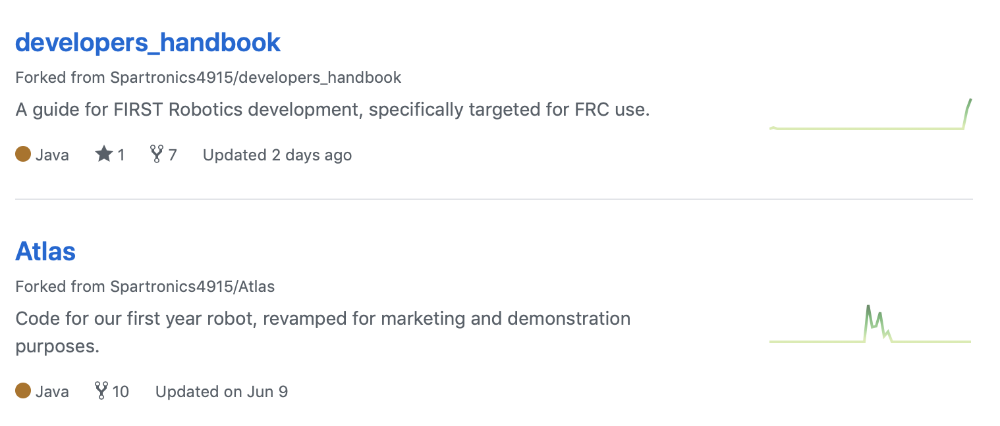

# Git Fundamentals

This section covers the basics of setting up the git environment and the most
commonly used commands.

- [Install the latest version of git for your computer](https://www.git-scm.com/downloads)
  - Simply click on the link for your operating system to download the installer
  - Follow the instructions to install the package
    - When prompted to choose an editor, choose `nano` for now.
  - Optionally [install GitHub's desktop GUI client](https://desktop.github.com/)
- If you don't already have one, [sign up for a free GitHub account](https://www.github.com)

Commands are executed in the terminal window. Examples in this document show the
command to be executed after a dollar sign ($) prompt.
*Do not type the dollar sign when entering commands.* Note that some commands
include quotes around words or phrases. These quotes are important --
*don't skip them*. Lines that begin with the hash symbol (#) are comments, for
informational purposes only.

**Important:** git provides helpful information -- pay attention to the git
output messages.

There are many git references and tutorials on-line. Here is the link to
[GitHub's bootcamp](https://help.github.com/categories/bootcamp/).

<!-- TOC -->

- [Git Fundamentals](#git-fundamentals)
  - [Understanding git](#understanding-git)
  - [Important set-up for the new git user](#important-set-up-for-the-new-git-user)
    - [Username & Email](#username--email)
    - [Default editor](#default-editor)
  - [Creating and contributing to a repo](#creating-and-contributing-to-a-repo)
    - [Git init](#git-init)
    - [Adding files](#adding-files)
    - [Git commit messages](#git-commit-messages)
    - [Git log and git show](#git-log-and-git-show)
    - [Git clone](#git-clone)
    - [Git fork](#git-fork)
    - [GitHub pull request](#github-pull-request)
    - [Merging](#merging)
    - [Merge conflicts](#merge-conflicts)
  - [Basic repo configuration](#basic-repo-configuration)
    - [Git remotes](#git-remotes)
    - [.gitignore](#gitignore)
  - [Git Commands](#git-commands)
    - [git help](#git-help)
    - [git init](#git-init)
    - [git status](#git-status)
    - [git pull vs git fetch && git merge](#git-pull-vs-git-fetch--git-merge)
    - [What is git checkout? And a branch?](#what-is-git-checkout-and-a-branch)
    - [git add and git commit](#git-add-and-git-commit)
- [push changes to your online repo](#push-changes-to-your-online-repo)
- [find the desired commit's hash](#find-the-desired-commits-hash)
- [reset to an example hash](#reset-to-an-example-hash)

<!-- /TOC -->

## Understanding git
Git is a _version control system_. It keeps track of changes that the
developer makes to the files in the repo, and allows these changes to
be shared with others, removed at a later time, or re-ordered and
combined to package several small changes into one.

A developer causes a change by editing files in the repo, or adding or
files from the repo. After editing the files, git must be told what the
change is so that it can track it. To do so, the developer groups the
changes together into a _commit_. The commit is the basic trackable
unit of git, and it is identified by a _hash_, a string of hexadecimal
numbers that uniquely identifies that particular change to the repo.

In order to create the commit, the developer will _add_ the files and
other changes to a _staging area_, where git keeps track of items that
will be included in the next commit. In this way, changes can be grouped
together into a batch that is included in a single commit.

All of the behind-the-scenes work performed by git goes on in a special
directory in the top directory of the repository: _.git_. This is the
place where changes are staged, and the rest of the repository history
is kept. Basically, the state of every file for the life of the repo is
instantly available to the developer through git commands that act on
the .git directory. (Note that the dot in front of the directory name
causes it to be hidden in a normal _ls_ directory listing. Use _ls -a_
to reveal these hidden files.)


## Important set-up for the new git user

### Username & Email
When a developer commits a change to a repository, the commit is labeled
with their user name and email address. It is important to set up your
development machine with valid identity information so that your teammates
know who is working on what. While you can set up any name/address you
like, for the purposes of our team please use your real name and email
address that you signed up for GitHub with.

You only need to set this up once when you install git on your computer.
After that, all repositories that you work in will be aware of your
identity. The information that you are entering here will be stored
in the _.gitconfig_ file in your user home directory.

```bash
# set username & email in global git configuration
$ git config --global user.name "Your Real Name"
$ git config --global user.email "your.real.email@somewhere.com"
```

### Default editor
Git brings up a text editor whenever the user is required to enter
information about a commit. The default editor that it chooses may
not be what the developer likes. It is possible to change the default
editor in a similar way to setting the user identity.

```bash
# set Visual Studio Code as the default editor in global git configuration
$ git config --global core.editor "code"
```

## Creating and contributing to a repo

### Git init
You can create a repo easily on your computer. Doing so will create
a private repo, as it is not automatically associated with a server
(ie, GitHub) that will allow it to be shared. You can create these
repos wherever you like, but be aware that creating a repo inside
another repo can be confusing to work in. Creating and using repos
from scratch is a great way to try out git without fear of messing
up a shared group repo.

If you are creating a brand new repo, create your working directory
first, and switch to that directory before initializing the repo.

```sh
# create your working directory to host your project
$ cd
$ mkdir my_coolest_project
$ cd my_coolest_project

# initialize git repo
$ git init
Initialized empty Git repository in /Users/binnur/my_coolest_project/.git/
```

Initializing a git repo automatically creates a .git directory to manage
tracked files.  Deleting this directory will delete all project history.
__Don't do that unless you really want to destroy your copy of the repository__

```sh
# list all files
$ ls -a
```

At this point, our project tracking is setup and ready to go, but there are
no files in the repo. Remember previous comment about how helpful git is?
Let's take a look at its status after _git init_.
It tells us to use _git add_ to track files we want to add to version control.

```sh
# show the status of git
$ git status
On branch master

No commits yet

nothing to commit (create/copy files and use "git add" to track)
```

### Adding files
To add some files to the repository, or to track the changes that are made
to files that are already in the repo, there is a two-step process: _add_
and then _commit_. The first step (the _add_) copies the file into a special
staging area inside the _.git_ directory of the repo. It is possible to
add multiple files, one at a time, in groups with wildcards, or even an
entire directory of files all at once. After adding files, you can check
what has been staged by using the _git status_ command.

```sh
# add the file ReadMe.txt to the staging area
$ git add ReadMe.txt
# add everything in the subdirectory Source to the staging area
$ git add Source
# check the repo status
$ git status
On branch master

No commits yet

Changes to be committed:
  (use "git rm --cached <file>..." to unstage)

        new file:   ReadMe.txt
        new file:   Source/main.c
        new file:   Source/main.h
```

With files ready to go, it's time to finalize the change to the repo. To
do this you use the _git commit_ command. This command takes the contents
of the staging area and bundles all of these new and changed files as a
group, and then asks you to describe the change with a _commit message_.
After the change has been described by the developer, it gets added to
the current branch history. _git status_ will report that the staging
area is empty, but _git log_ will now include the most recent commit
message, and the files will be updated with the changes.

```sh
# commit the staged files to the current branch history
$ git commit
# editor opens with the following text

    # Please enter the commit message for your changes. Lines starting
    # with '#' will be ignored, and an empty message aborts the commit.
    #
    # On branch master
    #
    # Initial commit
    #
    # Changes to be committed:
    #       new file:   ReadMe.txt
    #       new file:   Source/main.c
    #       new file:   Source/main.h
    #
# After entering a commit message ("Initial commit to my main repo")
[master (root-commit) e41977e] Initial commit to my main repo
 3 files changed, 23 insertions(+)
 create mode 100644 ReadMe.txt
 create mode 100644 Source/main.c
 create mode 100644 Source/main.h
# Check the results with git log
$ git log
commit e41977eff5a26d8db88a46e212e59095486fb432 (HEAD -> master)
Author: Riyadth Al-Kazily <riyadth@gmail.com>
Date:   Mon Nov 5 21:42:26 2018 -0800

    Initial commit to my main repo

    This code prints Hello world. It compiles without errors. It has not yet
    been tested on the robot.
```

### Git commit messages
_git commit_ messages are how changes to a repo are documented and described.
They are critical for collaboration, and also merely remembering what work
was done before. It is __very important__ that all developers write high quality
commit messages that are brief and to the point, and that follow the best
practices with regard to formatting. This is where you get to tell others
what your change does, how to use the feature, and even what additional
work needs to be done to enhance the feature in the future.

What is a bad commit message?
Check out examples [here](https://www.codelord.net/2015/03/16/bad-commit-messages-hall-of-shame/).

The commit message format is as follows.
- 1st line is a summary, 50 characters or less
- 2nd line is a blank line
- 3rd line and onward, 80 characters or less per line, describes the change in detail

Read more about writing good commits [here](https://tbaggery.com/2008/04/19/a-note-about-git-commit-messages.html).

### Git log and git show
_git log_ is a great way to explore the contents of a repo.
An important thing to note is the git hash, the long string of _hexadecimal_
digits that identifies each unique commit. This hash is important for
manipulating individual commits, and also for "going back in time" to
examine the project at any previous point in its history.
Some handy git log options.

```sh
# basic git log
$ git log
# one line summary of commits
$ git log --oneline
# commit statistics
$ git log --stat
# commits by author
$ git shortlog
# pretty the output
$ git log --pretty="%cn committed %h on %cd"
# commits for an author
$ git log --author="Tarkan"
```

_git show_ displays detailed information on a given commit. As the parameter,
you provide the first several characters of the commit hash you want to see.

```sh
$ git show 97a7c5f0d
$ git show 97a7c5f0d --stat
```

### Git clone
_git clone_ is the process of creating a copy of a shared remote repository.
The command takes a parameter that is the location of the remote repo,
and this location can be another git directory on the same machine, or
a URL that points to a remote network location.

With GitHub you can simply copy the URL for the repo and execute a _git clone_
command on your system to create a copy.

GitHub provides HTTPS or SSH URLs for cloning. HTTPS is the easiest way to
clone a public repository that you don't intend to push changes to. SSH uses
the _secure shell_ protocol to create an authenticated two-way link between
your computer and GitHub, and requires that you set up shared keys on your
machine and GitHub.
You can read more about this [here](https://help.github.com/articles/which-remote-url-should-i-use/)


```sh
# Clone the Atlas repository into your current directory
$ git clone https://github.com/Spartronics4915/Atlas.git
Cloning into 'Atlas'...
remote: Enumerating objects: 1144, done.
remote: Total 1144 (delta 0), reused 0 (delta 0), pack-reused 1144
Receiving objects: 100% (1144/1144), 219.01 KiB | 2.28 MiB/s, done.
Resolving deltas: 100% (461/461), done.
```

### Git fork
GitHub supports the use of the _forking workflow_. In this workflow, the
developer duplicates the main project repo into their own GitHub account
workspace, and then clones that duplicated repo onto their computer in
order to make changes to the project. In this way, the developer can
make all the changes that they want to the clone on their machine, and
can also push those changes to their copy of the repo on GitHub, without
affecting the main project at all.

Here are example of forks in my GitHub account.


You can _fork_ any of the repositories you wish to copy, simply by clicking
on the "fork" button.


Once you have a fork in your account, you can _git clone_ it to your system.
Any changes you make to your forked repo will not impact the main project repo.
When you are satisfied that you have
a change that should be included in the main project, create a
_pull request_ to allow the team to review the changes and then _merge_
them from your repo into the main team repo. If issues are found,
the reviewer can make suggestions for changes to be made before merging.

### GitHub pull request
You can contribute your changes (that you pushed to your fork) to the
_upstream_ repository by submitting a _pull request_. You do this on
GitHub, as pull requests are not a part of the basic git tool. They are
part of a workflow that GitHub provides, to make it easier for groups
to work together on the same repository.

The basic idea is that you select the branch with changes in your repo
that you want to submit to the main project repo, and also specify the
destination branch in the main repo. When you submit the pull request,
the managers of the main repo are notified and can review your changes
for any issues, and can make comments if there are things that they need
you to fix. If they accept the changes, they click a button to _merge_
your changes into the main repository, after which everyone on the team
can _fetch_ or _pull_ the changes into their local repostories.

[See GitHub documentation](https://help.github.com/articles/creating-a-pull-request-from-a-fork/).

### Merging
When a pull request is accepted, the changes from the developer repo are
_merged_ into the main repo. It is also possible to merge one branch
into another within your own repo, or merge a remote branch on GitHub
into your private working branch.

The _merge_ operation is how git reconciles two different histories into
one. In the simplest case, a merge operation performs a _fast forward_,
adding the new change to the end of the commit history. The new commits
appear at the very top of the _git log_ output, before any of the old,
existing commits.

Usually things are not so simple, however. It is common for two or more
developers to all be making changes to their copies of the repository
at the same time, and the first developer to make a pull request will
have no issues with their changes, as they will be a _fast forward_
merge. However, the remaining developers merges will be trying to
add their changes to a history that doesn't match the local repo (as the
main repo now contains a new commit). In this case, git tries to take
care of everything and creates a merge commit to reconcile any differences
between the two histories.

Often a merge commit goes fine. Sometimes there are odd artifacts as
a result of two developers working on the same area of functionality.
But sometimes git cannot resolve the two histories into one, and
throws up a scary looking message about a _merge conflict_. This can
happen if two developers both made changes to the same file, especially
if their changes were very close together (or even on the same line of
code).

### Merge conflicts
In a collaborative environment, merge conflicts are inevitable.
A merge conflict occurs when changes in your history are nearby changes
made by another developer, and that other developer merged their changes
into the main repo first. Basically it is a conflict that the git tool
is not smart enough to fix on its own, as it doesn't know who's changes
are more important, or how one set of changes might affect the other.

For example, if one developer changed the variable names in a function
to make a formula easier to read, and another developer broke up the
confusing formula and put comments in between lines, these changes could
not be merged together and git would report a conflict.

When a merge conflict happens, git requires the second developer to
decide which changes are valid in the final merge. In the case of this
example, the developer can choose to keep the new variable names or the
comments, or both.

Frequently syncing your local repository with your upstream/main repo helps
avoid potential merge conflicts.
This requires frequent _git pull_ from the upstream to ensure you have a
complete set of changes from other developers before creating your changes.
The more out of sync your local repo is from the upstream, the more merge
conflicts you can expect to have.

## Basic repo configuration

### Git remotes
For background on _git remotes_, see [What is a repo and remotes?](./git_about.md#"What-is-a-repo-and-remotes").

```sh
# specify your URL for the upstream
$ git remote add upstream https://github.com/Spartronics4915/2017-STEAMworks
# show remotes for my local developers_handbook repo
$ git remote -v
binnur  git@github.com:binnur/developers_handbook.git (fetch)
binnur  git@github.com:binnur/developers_handbook.git (push)
origin  git@github.com:Spartronics4915/developers_handbook.git (fetch)
origin  git@github.com:Spartronics4915/developers_handbook.git (push)
```

Using these remotes, I can pull updated history from _origin_, i.e. Spartronics'
repo for developers_handbook, to stay in sync with other developers on the repo.
Using the _binnur_ remote I can push my updates to my GitHub repo in order to
submit a pull request to Spartronics.

Note, your remotes can be named to anything.
However, we will use the standard 'upstream' to refer to the source,
and 'origin' to refer to our fork.
It is not wise to name a remote the same as a branch (ie, don't name a
remote _master_), or vice-versa. It can make git operations very confusing.

### .gitignore
The _.gitignore_ file lists all files (by name, or via wildcard characters)
that should not be tracked by git. This is useful to keep build artifacts or
developer-specific configuration files out of git, so that they don't affect
the development environment of other contributors.
See [GitHub's ignoring files for more information](https://help.github.com/articles/ignoring-files/).

```sh
# ignore sketch files, anywhere in the git repo
$ cat .gitignore
*.sketch
```

## Git Commands

### git help
You can access git help anytime -- and don't forget to pay attention
to git messages after git commands are executed! (They are trying to tell
you something...)

```sh
# git help
$ git help
# git help on status command
$ git help status
# git help on clone command
$ git help clone
```

### git init
See [git init](./#Git-init) section for more information.

```sh
# initialize git repo
$ git init
Initialized empty Git repository in /Users/binnur/my_coolest_project/.git/
```

### git status
_git status_ is your friend! It is an overview of the status of the repo.

```sh
$ git status
On branch gitintro
Your branch is ahead of 'binnur/gitintro' by 1 commit.
  (use "git push" to publish your local commits)

Untracked files:
  (use "git add <file>..." to include in what will be committed)

    .gitignore
    git_intro/git_advanced.md
    git_intro/git_configure.md
    git_intro/git_faq.md
    git_intro/git_fundamentals.md
    git_intro/images/.DS_Store
    git_intro/images/clone.png
    git_intro/images/forking.png
    git_intro/images/forks.png
    git_intro/images/git_staging.png
    robot_lessons/.vscode/
    robot_lessons/.wpilib/
    robot_lessons/lesson1.code-workspace
    robot_lessons/lesson1/.settings/org.eclipse.jdt.core.prefs
    robot_lessons/lesson1/build/
    tutorials.code-workspace

nothing added to commit but untracked files present (use "git add" to track)
```

Looking at the git status, I can tell:
- I am on the 'gitintro' branch
- My branch is ahead of its remote by 1 commit, meaning other developers
    following my fork on binnur/gitintro can not see my most recent change
- I have several untracked files and I need to use _git add_ to add them to the repo

### git pull vs git fetch && git merge
_git pull_ vs _git fetch && git merge_ has a similar outcome with different
intents.

_git pull_ pulls the changes from the remote and magically applies them to your
local repo. It is a _fetch && merge_ in one. The _git pull_ fetches and
downloads content from a remote repository and immediately updates the local
repository to match that content.

```sh
# by default fetches from the remote your local repo is tracking and applies to your current branch
$ git pull
```

However, as it is magical, the recommendation is to use _fetch_ and _merge_ to
ensure you understand how your working directory will be updated, this is
important when you get to next level of git with branches.

_git fetch_ downloads all related commits, files, etc. from the remote repo
to your local repo. It allows you to see what everyone has been working on.
As it does not apply the changes to the currently checked out branch of your
local repo, _git fetch_ allows you to review changes and decide how to
_git merge_ the updates.

```sh
# fetch changes from all remotes
$ git fetch --all
# fetch specific remote & branch
$ git fetch upstream master
# dry-run fetch command
$ git fetch --dry-run <remote_name>
```

_git merge_ will apply the changes to your local repo after _git fetch_.

```sh
# merge origin/master into your current branch
$ git merge origin/master
# merge all of origin's content into your current branch
$ git merge origin
```

The merge process can result in conflicts -- this is basically git's way of saying
it cannot automatically decide how to handle conflicts and it needs help to
determine which version/entry is the correct one. Read more on [handling merge
conflicts](https://help.github.com/articles/resolving-a-merge-conflict-using-the-command-line/).

### What is git checkout? And a branch?
When you perform _git clone_, git will automatically _checkout_ the default
branch that is set by the remote repo. _git checkout_ allows the developer
to switch between different versions of a branch or commits. This process
updates the contents of your working directory to match the state of that
branch or commit.

In general, you can checkout any number of branches, such as creating a
feature branch to ensure your master branch is production ready at all times.
You will always be able to _pull_ or _merge_ upstream changes into your master
branch without conflicts because you make your modifications only to the
feature branch(es), and push those branches to GitHub to submit merge requests.

```sh
# create and checkout a new branch in one go
$ git checkout -b my-new-branch
# above command with '-b' is same as:
$ git branch my-new-branch
$ git checkout my-new-branch
# checkout master branch
$ git checkout master
# checkout a specific branch
$ git checkout <branch-name>
# print a list of branches
$ git branch -a
```

### git add and git commit
_git add_ and _git commit_ are used in combination to 'save' the git repo's
current state. _git add_ makes a change to the staging area by adding
files from working directory to the repo's staging area. Changes are not
recorded until you _git commit_.

As discussed in the [git status](./#git-status) section,
_git status_ highlights the status of the repo.

```sh
# start tracking the git_fundamentals.md file
$ git add git_intro/git_fundamentals.md
# add every file in the current directory
$ git add .
# add every file in the specified directory
$ git add <dir name>
```

_git commit_ will publish the git_intro/git_fundamentals.md file to the
local repo

```sh
$ git commit
[gitintro c0bbf03] Initial content to 'git' going
 1 file changed, 325 insertions(+)
 create mode 100644 git_intro/git_fundamentals.md
 ```

Passing the `-m` flag allows you to write your commit message without the use of a visual editor. As such:

```sh
$ git commit -m "This is a test commit."
[gitintro f313252] This is a test commit.
 20 files changed, 103 insertations(+), 102 deletions(-)
 create mode 100644 git_intro/README.md
```

### git push
Using _git push_ commits changes made to your local repo to remote repository.
_git push_ takes two arguments:
- remote name, ex. _origin_
- branch name, ex. _master_

```sh
# push changes to your online repo
$ git push origin master
Enumerating objects: 12, done.
Counting objects: 100% (12/12), done.
Delta compression using up to 4 threads
Compressing objects: 100% (8/8), done.
Writing objects: 100% (9/9), 447.26 KiB | 20.33 MiB/s, done.
Total 9 (delta 2), reused 0 (delta 0)
remote: Resolving deltas: 100% (2/2), completed with 2 local objects.
To github.com:binnur/developers_handbook.git
   30d5926..71bda4d  gitintro -> gitintro
```

### git reset

Sometimes you mess up, and don't realize it until after committing your changes.

Git makes it easy to _revert_ your changes with use of the `git reset` command. Git reset lets you revert to a previous commit hash, which you have to find first with `git log`.

Usage:
```sh
# find the desired commit's hash
git log
# reset to an example hash
git reset aGV5Y2hlY2tvdXR0aGlzY29tbWl0
```

An even easier way to do this is using HEAD. `git reset HEAD` resets to the last commit, and `git reset HEAD^` resets to the one before that.

Passing the `--hard` tag between `reset` and the commit hash will get rid of _all_ changes. **This is dangerous, and should be used with great caution.**
