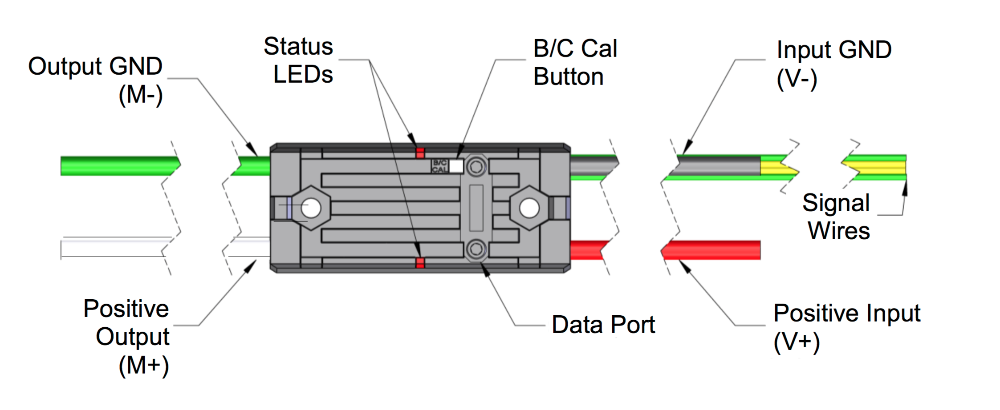
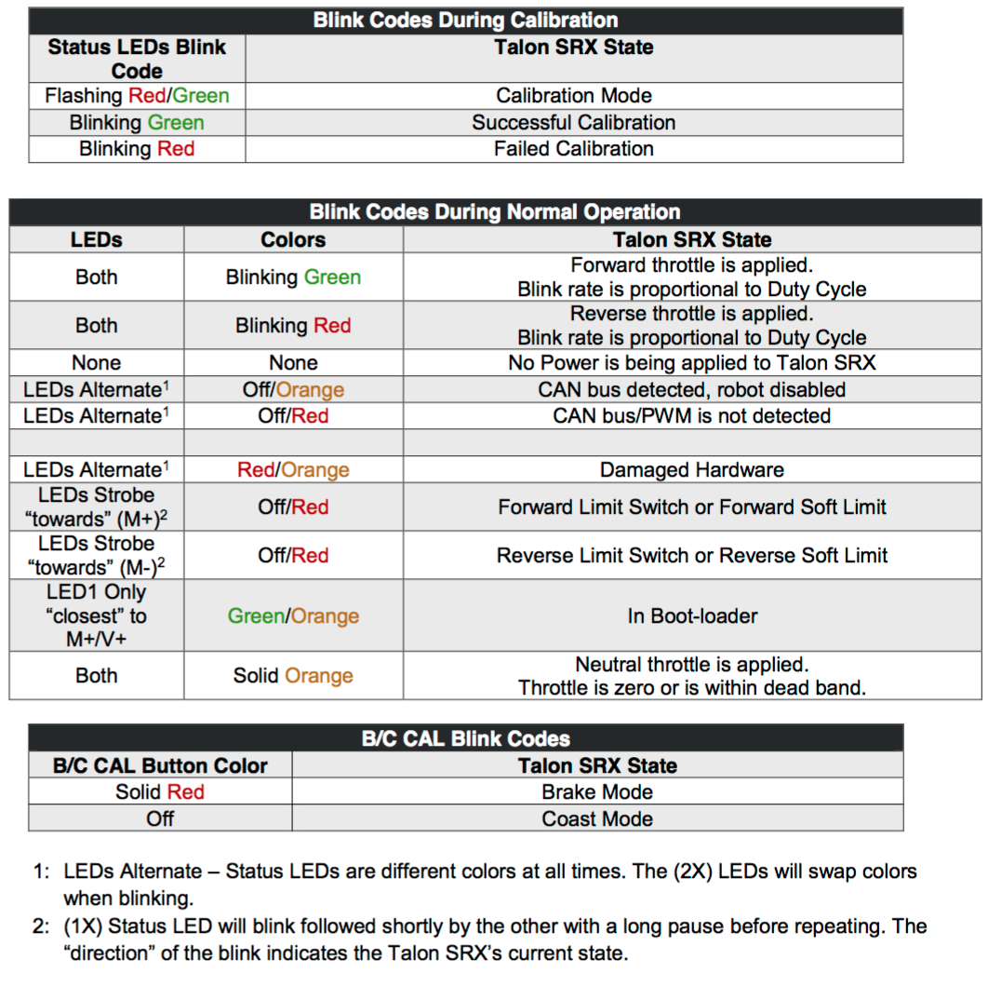

# Table of Contents
- #### [Introduction to Talon SRX](./README.md)
- #### [Capabilities of Talon SRX](./capabilities.md)
- #### [Programming Talon SRX](./programming.md)
- #### [Troubleshooting Talon SRX](./troubleshooting.md)

# Introduction to Talon SRX
The Talon SRX speed controller is a CAN-enabled "smart motor controller" from Cross The Road Electronics/VEX Robotics. The Talon SRX can be controlled over the CAN bus or PWM interface. When using the CAN bus control, this device can take inputs from limit switches and potentiometers, encoders, or similar sensors in order to perform advanced control such as limiting or PID(F) closed loop control on the device. Features at a high-level:

- Onboard closed-loop PID control algorithm
- Breakout board for wiring a quadrature encoder or limit switch
- Support for CAN bus or PWM interface



## What is CAN?
CAN, Controller Area Network, provides a network that helps multiple CAN devices communicate with one another without a host computer. Each of the devices on the network has a CAN controller chip and is therefore intelligent, and all devices can see all transmitted messages. Each device can decide if a message is relevant or if it should be filtered.

CAN was first created for automotive use, so its most common application is in-vehicle electronic networking. Medical equipment manufacturers use CAN as an embedded network in medical devices.

## Why CAN over PWM?
The Talon SRX’s Data Port and CAN bus features make it the most capable motor controller available for competition robotics. The Data Port allows Quadrature Encoders, Limit Switches and Analog Sensors to be connected directly to the motor controller. Sensors that are connected through the Data Port are directly processed by the Talon SRX. Upto 63 Talon SRXs to be daisy chained – this means Talon SRXs can plug into each other and only require a single output on the primary robot controller.

One of the simplest ways to control a Talon SRX is using a Pulse Width Modulation (PWM) signal. Unlike CAN bus control, using PWM requires that each Talon SRX must be individually connected to a different output on the system’s primary robot controller – Talon SRXs cannot be daisy chained in PWM mode. When using PWM to control the Talon SRX, only limit switches (or equivalent binary switches) may be used with the Data Port. Encoders or Analog sensors cannot be used.

## Reference Documentation
- [Talon SRX Home](http://www.ctr-electronics.com/talon-srx.html#product_tabs_technical_resources)
- [Talon Users Guide](http://www.ctr-electronics.com/Talon%20SRX%20User's%20Guide.pdf)
- [Talon Software Reference Manual Manual](http://www.ctr-electronics.com/Talon%20SRX%20Software%20Reference%20Manual.pdf)
- [CTR Electronics GitHub Examples](https://github.com/CrossTheRoadElec/FRC-Examples)
- [WPILib APIs](http://first.wpi.edu/FRC/roborio/release/docs/java/)

# Setup & Debugging
Use roboRIO Web-based Configuration page to setup and debug Talon SRX. This includes things such as:

- Assigning device IDs Talon SRXs
- Firmware updates
- Monitoring and debugging device operations

The driver station also provides various CAN bus metrics, such as CAN bus utilization, under the “lightning bolt” tab.

See tips and tools for [Debugging](#debugging).

## roboRIO Web-based Configuration Tool
Silverlight is required to access the web-based configuration tool (no Chrome support!). Note, manual refresh of the page is required after configuration changes. Recommended browser: IE
```
// For 2016 configuration
http://roborio-XXXX-frc.local --> http://roborio-4915-frc.local
```
Checking the “Light Device LED” and pressing “Save” can be used to identify which physical Talon SRX is selected.


## How Many Talon SRXs?
Generally speaking a maximum of 16 Motor controllers can be powered at once using a single PDP (sixteen breaker slots). However FRC game rules should always be checked as it determines what it considered legal.

Release software is tested to support 16 Talon SRXs, 1 PCM, and 1 PDP with guaranteed control of each Talon at a rate of 10ms. If faster response time is desired, control frame periods can be decreased from the default 10ms, but keep a watchful eye of the CAN bus utilization to ensure reliable communication.

## Can RobotDrive be used with CAN Talons? What if there are six Talons?
> The default RobotDrive object in LabVIEW/C++/Java already supports two-Talon and four-Talon drivetrains. Simply create the CANTalon objects and pass them into the RobotDrive example.
> For six drive Talons, the four-motor examples for Robot Drive can be used with four CANTalon objects, then create the final two Talons and set them to slave/follower mode.

See [JAVA_Six_CANTalon_ArcadeDrive example](https://github.com/CrossTheRoadElec/FRC-Examples).


## Wiring
_From [Talon Users Guide](http://www.ctr-electronics.com/Talon%20SRX%20User's%20Guide.pdf), section 1.3.2.2_

>Teams should consult the FRC game rules for CAN wiring requirements. However it is recommended to use yellow for CANH and green for CANL for the following reasons...
- Makes robot inspection and troubleshooting easier.
- The colors match what is labeled on the FRC Robot Controller, Power Distribution Panel, and Pneumatic Control Module.
- The colors match the Talon SRX cable harness.
AWG 22 or similar gauge wiring can be used. An electric drill can be used to twist the CANH/CANL wire pair.

> The Talon SRX’s mounting location should be chosen to allow for adequate air flow around the heat fins and sides of the case. For maximum heat dissipation it is recommended that the Talon SRX be securely mounted to a robot’s metal frame – this allows the robot to be used as a giant heat sink to aid in cooling.

## Firmware Update
Firmware updates are done using the FRC roboRIO Web-based Configuration. Check [Talon SRX Home](http://www.ctr-electronics.com/talon-srx.html#product_tabs_technical_resources) for latest firmware.
> Firmware version is checked at the competition. Make sure all firmware is updated and versions verified prior to competition.

## Device IDs and Names
A Talon SRX can have a device ID from 0 to 62. 63 is reserved for broadcast.
> Regardless of the programming language, device ID is programmatically used for specifying which Talon SRX you are  controlling.

```java
// Example: drive train left motor is on device ID 10
 private static final int DRIVE_TRAIN_LEFT_MASTER_10 = 10;
 public static CANTalon leftMaster10 = new CANTalon(DRIVE_TRAIN_LEFT_MASTER_10);
```

Custom name can be assigned to a Talon SRX using the roboRIO web configuration tool, such as 'Drive Motor 10' for easy debugging.

## Debugging and Troubleshooting
Also see:
- [Talon Users Guide](http://www.ctr-electronics.com/Talon%20SRX%20User's%20Guide.pdf) Troubleshooting, section 3
- [Troubleshooting Tips](./troubleshooting.md)

### Understanding Blink Codes
See [Talon Users Guide](http://www.ctr-electronics.com/Talon%20SRX%20User's%20Guide.pdf) Blink Codes, section 2.3



### CAN Bus Utilization/Errors Metrics
See CAN bus Utilization/Error metrics section in the [programmer's manual](http://www.ctr-electronics.com/Talon%20SRX%20Software%20Reference%20Manual.pdf).
> The driver station provides various CAN bus metrics under the “lightning bolt” tab.
Utilization is the percent of bus time that is in use relative to the total bandwidth available of the 1Mbps Dual Wire CAN bus. So at 100% there is no idle bus time (no time between frames on the CAN bus).

> When starting out with the FRC control system and Talon SRXs, it is recommend to watch how these CAN metrics change when CAN bus is disconnected from the roboRIO and other CAN devices to learn what to expect when there is a harness or a termination resistor issue. Determining hardware related vs software related issues is key to being successful when using a large number of CAN devices.
