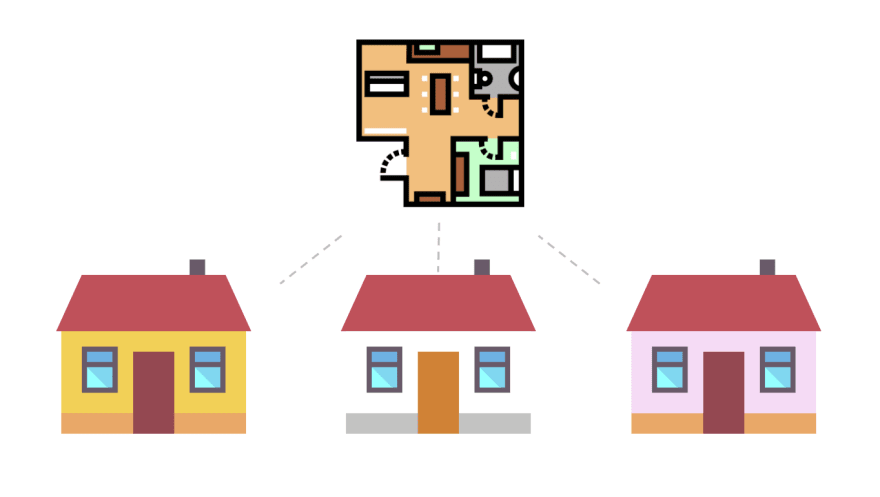

# Classes and Objects

<!-- TOC -->

- [Classes and Objects](#classes-and-objects)
  - [More on Classes](#more-on-classes)
  - [More on Objects](#more-on-objects)
    - [Constructor Methods and `new`](#constructor-methods-and-new)
    - [Abstraction](#abstraction)
  - [Member Variables](#member-variables)
  - [Class vs. Object](#class-vs-object)

<!-- /TOC -->

You may have heard that Java is an _object oriented_ language. For our purposes, this means that Java has **classes** and **objects**.



Classes are like the blueprints that objects are made of. It's like I have a blueprint for a house. I have one blueprint, and I can make many houses from it. In this analogy, I have one class from which I can make many objects.

Objects are like the houses made from that blueprint. They're **tangible** - in real life, you could reach out and touch a house. In our programming world, this means that you can _call methods_ on them.
Additionally, different styles of houses (objects) can be made from the same blueprint (class), depending on what I _pass_ when _constructing_ the object. <br>
You'll revisit these terms in depth later, but just keep in mind that not every object is identical.

## More on Classes

Just like a blueprint


## More on Objects

An object is an instance of a class.

More specifically, objects are composed of _fields_ (member variables) and _methods_. Let's break down the following example:

```java
public class House {
    private String mAddress; // Private member variable (field) called mAddress
    public int mFloors; // Public member variable (field) called ____

    // Constructor method that takes the controller's address
    public House(String address) {
        mAddress = address;
        mFloors = 2;
    }

    // This method just returns the value of mAddress
    public int getAddress() {
        return mAddress;
    }
}
```

### Constructor Methods and `new`

A keen reader might have noticed that `public MotorController(int address)` does not specify a return type. This is not, however, a syntax error. This is a special type of method called the constructor. It is called whenever we make an instance (a new object) of this class.

Each object must be constructed (instantiated) using the `new` keyword.

To make a `new` `House`:
```java

```

### Abstraction

At this point, you might be thinking that the `getAddress` method seems kind of unnessary. Wouldn't it be easier to just make mAddress public?


## Member Variables

## Class vs. Object
As you can see, we define all of this as a class called MotorController. However, if I called `MotorController.getAddress()`, that would be an error. That is because I am calling that method on the class, but I really need to call it on an _object_ (instance) of the class. To do that, I need to use the `new` keyword, and make a new `MotorController` object. I would do that like this:

```java
MotorController motor = new MotorController(3);
System.out.println(motor.getAddress());
```

If I wanted to make a method that is allowed to be called on the class itself, I would use the `static` keyword:

```java
public static int getAddress() {
  return 3;
}
```

It is important to note that if tried to access `mAddress` in this static method, it would result in an error, because there's no way to access member variables from static methods. However, you can access static

The key concept here is that I can access variables and methods on a class, or an object, but

@TODO: Complete
