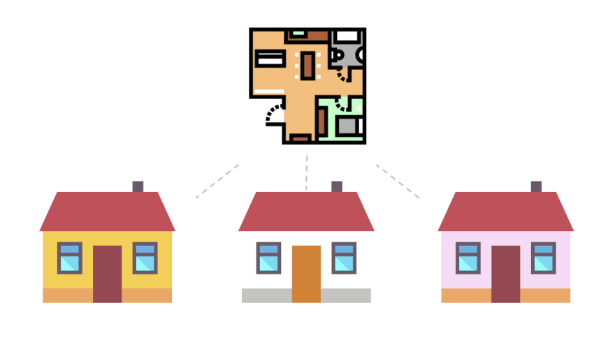

# Classes and Objects

<!-- TODO: unify houses and motors -->

<!-- TOC -->

- [Classes and Objects](#classes-and-objects)
  - [Classes vs. Objects](#classes-vs-objects)
  - [More on Classes](#more-on-classes)
    - [Public vs. Private](#public-vs-private)
    - [Concept: Encapsulation](#concept-encapsulation)
    - [In the Scope of Things](#in-the-scope-of-things)
  - [More on Objects](#more-on-objects)
    - [Objects and the Static keyword](#objects-and-the-static-keyword)
    - [Constructor Methods and `new`](#constructor-methods-and-new)
  - [Conclusion.](#conclusion)

<!-- /TOC -->

## Classes vs. Objects

You may have heard that Java is an _object oriented_ language. For our purposes, this means that Java has **classes** and **objects**.



Classes are like the blueprints that objects are made of. It's like I have a blueprint for a house. I have one blueprint, and I can make many houses from it. In this analogy, I have one class from which I can make many objects.

Objects are like the houses made from that blueprint. They're **tangible** - in real life, you could reach out and touch a house. In our programming world, this means that you can _call methods_ on them.
Additionally, different styles of houses (objects) can be made from the same blueprint (class), depending on what I _pass_ when _constructing_ the object.

## More on Classes
Classes are composed of _methods_ and _fields_. We've already gone over methods. _Fields_ are just another term for variables within a class.

Let's take a look at this `House` class:

```java
public class House {
  private String mAddress; // Private field called mAddress
  public int mFloors; // Public field called mFloors

  // Constructor method that takes the controller's address
  public House(String address) {
    mAddress = address;
    mFloors = 2;
  }

  // This method just returns the value of mAddress
  public int getAddress() {
    return mAddress;
  }
}
```

You might have noticed that this `House` class doesn't contain a `main` method. That's because this `House` is not a complete program, rather, it's just a blueprint for a House object. If you want to run your methods, you'll need to call them on an _instance_ within a `main` method.

```java
import House.java
public class HouseRunner {
  public static void main (String[] args) {
    myHouse = new House("1600 Pennsylvania Ave.");
    System.out.print(myHouse.getAddress());
  }
}
```

### Public vs. Private
All of the variables and methods within the `House` are prefixed with either `public` or `private`. These are known as _access modifiers_, as they control what classes or methods have _access_.

_Public_ allows for a method or variable to be accessed by _anything_ with access to the class. It's the least protective modifier, and should be used only when you don't care what uses your methods or variables.

_Private_ doesn't allow modification, or even access, to anything outside of the class or method. If you have a sensitive variable (such as the speed of a motor) that you don't want external classes changing, `private` is the modifier for the job.

`public` and `private` can be used on classes to much the same effect.

### Concept: Encapsulation
At this point, you might be thinking that the `getAddress` method seems kind of unnessary. Wouldn't it be easier to just make mAddress public? The issue in doing that lies in the concept of _encapsulation_.

Encapsulation is kind of like creating a protective shield (or capsule) around our variables. If we decided to make `mAddress` public, _anyone_ with access to an instance of a `House` could modify them. But by making a `private` variable and then allowing access through a method, it's available to everyone, but only the `House` class can modify it.

Something similar to encapsulation is the `final` modifier. The `final` modifier prevents the modification of a variable, and is sometimes used with `public` in Constants files. However, the difference between `public final` and encapsulation is that `public final` prevents _all_ modification of the variable, even in its own class. For this reason, we use encapsulation much more often.

### In the Scope of Things
We've talked about how `public` and `private` can change how a variable or method is accessible, but _where_ they're defined affects the accessibility. This "accessibility" is called _scope_.

If I create a variable inside of a method, I can't access it from outside of that method. This is called _method scope_.

Scope is also affected by the `static` keyword, but we'll get more into that later.

## More on Objects

Take a look at the code below.

<!-- TODO: is this the right code? -->

```java
MotorController motor = new MotorController(3);
```

As you can see, we define all of this as a class called MotorController. However, if I called `MotorController.getAddress()`, that would be an error. That is because I am calling that method on the class, but I really need to call it on an _object_ (instance) of the class. To do that, I need to use the `new` keyword, and make a new `MotorController` object. I would do that like this:

```java
MotorController mArmMotor = new MotorController(3);
System.out.println(mArmMotor.getAddress());
```

### Objects and the Static keyword

However, Java has an exception to this. If I wanted to make a method that is allowed to be called on the class itself, I would use the `static` keyword:

```java
public static int getAddress() {
  return 3;
}
```

It is important to note that if tried to access `mAddress` in this static method, it would result in an error, because there's no way to access member variables from static methods. However, you _can_ access static member variables.

```java
public class House {
  private String mAddress = "1600 Pennsylvania Ave.";
  private static int mFloors = 2;

  public static int getFloors() { // This will return 2.
    return mFloors;
  }
  public static String getAddress() { // !!! This **doesn't work!**
    return mAddress;
  }
}
```

The key concept here is that I can only access variables and methods on an object, unless they were defined with the `static` keyword.

### Constructor Methods and `new`

A keen reader might have noticed that `public MotorController(int address)` does not specify a return type. This is not, however, a syntax error. This is a special type of method called the constructor. It is called whenever we make an instance (a new object) of this class.

Each object must be constructed (instantiated) using the `new` keyword.

To make a `new` `House`:
```java
myHouse = new House("1600 Pennsylvania Ave.");
```

In this case, we're passing `"1600 Pennsylvania Ave."` to the constructor, which takes it and sets the `mAddress` variable to it. This is a good example of when to _not_ use static methods - if we attempted to call `getAddress` without having constructed an object, our `House` class wouldn't have an address to return to us.

<!-- ### Concept: Composition -->

## Conclusion.
That was a lot. Classes and objects take some time to fully understand, so don't be shy to refer back to this when doing the Practice-It problems.
