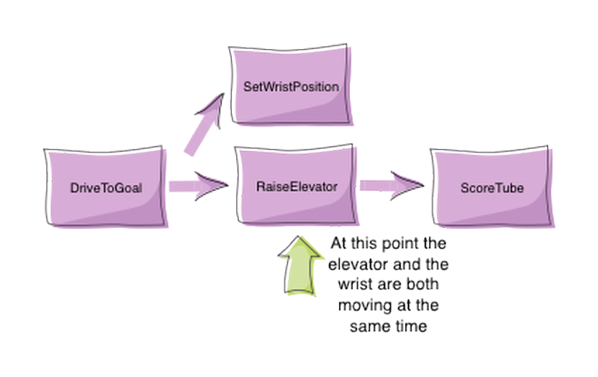

# Lesson 4: Command Groups

<!-- Note: This is directly lifted from the WPILIB docs -->
<!-- As I think specifically this article is fantastically structured -->

<!-- TOC -->

- [Lesson 4: Command Groups](#lesson-4-command-groups)
  - [What are Command Groups?](#what-are-command-groups)
  - [Types of Command Groups](#types-of-command-groups)
    - [`SequentialCommandGroup`](#sequentialcommandgroup)
    - [`ParallelCommandGroup`](#parallelcommandgroup)
    - [`ParallelRaceGroup`](#parallelracegroup)
    - [`ParallelDeadlineGroup`](#paralleldeadlinegroup)
  - [Constructing a Command Group](#constructing-a-command-group)
  - [Features of the Command Group](#features-of-the-command-group)
    - [Inline Command Groups](#inline-command-groups)
    - [Recursive Composition](#recursive-composition)
    - [Subsystem Requirements](#subsystem-requirements)

<!-- /TOC -->

## What are Command Groups?

Individual commands are capable of accomplishing a large variety of robot tasks, but the simple three-state format can quickly become cumbersome when more advanced functionality requiring extended sequences of robot tasks or coordination of multiple robot subsystems is required. In order to accomplish this, we can use the powerful `CommandGroup` functionality included in the Command-based library.

As the name suggests, `CommandGroup`s are combinations of multiple commands. The act of combining multiple objects (such as commands) into a bigger object is known as _composition_. `CommandGroup`s are compositions of multiple commands. This allows code to be kept much cleaner and simpler, as the individual _component commands_ may be written independently of the code that combines them, greatly reducing the amount of complexity at any given step of the process.

Most importantly, however, `CommandGroup`s themselves **are** commands - they implement the Command interface. This allows `CommandGroup`s to be recursively composed - that is, a `CommandGroup` may contain other `CommandGroup`s as components.

## Types of Command Groups

The command-based library supports four basic types of `CommandGroup`s: `SequentialCommandGroup`, `ParallelCommandGroup`, `ParallelRaceGroup`, and `ParallelDeadlineGroup`. Each of these command groups combines multiple commands into a composite command - however, they do so in different ways.

### `SequentialCommandGroup`

A `SequentialCommandGroup` runs a list of commands in sequence - the first command will be executed, then the second, then the third, and so on until the list finishes. The sequential group finishes after the last command in the sequence finishes. It is therefore usually important to ensure that each command in the sequence does actually finish (if a given command does not finish, the next command will never start!).

The `sequence` method allows use of this within a `CommandBase` class.

### `ParallelCommandGroup`

A `ParallelCommandGroup` runs a set of commands concurrently - all commands will execute at the same time. The parallel group will end when all commands have finished.

The `parallel` method allows use of this within a `CommandBase` class.

### `ParallelRaceGroup`

A `ParallelRaceGroup` is much like a ParallelCommandgroup, in that it runs a set of commands concurrently. However, the race group ends as soon as any command in the group ends - all other commands are interrupted at that point.

The `race` method allows use of this within a `CommandBase` class.

### `ParallelDeadlineGroup`

A `ParallelDeadlineGroup` also runs a set of commands concurrently. However, the deadline group ends when a specific command (the “deadline”) ends, interrupting all other commands in the group that are still running at that point.

The `deadline` method allows use of this within a `CommandBase` class.

## Constructing a Command Group

A typical `CommandGroup` looks like the following.

```java
public class AgitateThenShootGroup extends CommandBase {

  addCommands(new AgitateCommand(), new ShootCommand());
}
```

It's very

- Given the commands `ShootCommand`, `UnjamCommand`, and `StopCommand`, create a `CommandGroup` `UnjamStopGroup` to unjam and _then_ stop the command.

## Features of the Command Group

### Inline Command Groups

Command groups can be used without subclassing at all: one can simply pass in the desired commands through the constructor.

```java
public SequentialCommandGroup Climb = new SequentialCommandGroup(new ClimberExtend(), new ClimberRetract());
```

This is called an inline command definition, and is very handy for circumstances where command groups are not likely to be reused, and writing an entire class for them would be wasteful.

### Recursive Composition

As mentioned earlier, command groups are recursively composable - since command groups are themselves commands, they may be included as components of other command groups. This is an extremely powerful feature of command groups, and allows you to build very complex robot actions from simple pieces. For example, consider the following code.

```java
new SequentialCommandGroup(new DriveToGoal(m_drive), new ParallelCommandGroup(new RaiseElevator(m_elevator), new SetWristPosition(m_wrist)), new ScoreTube(m_wrist));
```

This creates a sequential command group that contains a parallel command group. The resulting control flow looks something like this.



Notice how the recursive composition allows the embedding of a parallel control structure within a sequential one. Notice also that this entire, more-complex structure, could be again embedded in another structure. Composition is an extremely powerful tool, and one that you should be sure to use extensively.

### Subsystem Requirements

As command groups are commands, they also must declare their requirements. However, you are not required to specify requirements manually for command groups - requirements are automatically inferred from the commands included. As a rule, command groups include the union of all of the subsystems required by their component commands.

Additionally, requirements are enforced within all three types of parallel groups - a parallel group may not contain multiple commands that require the same subsystem.

